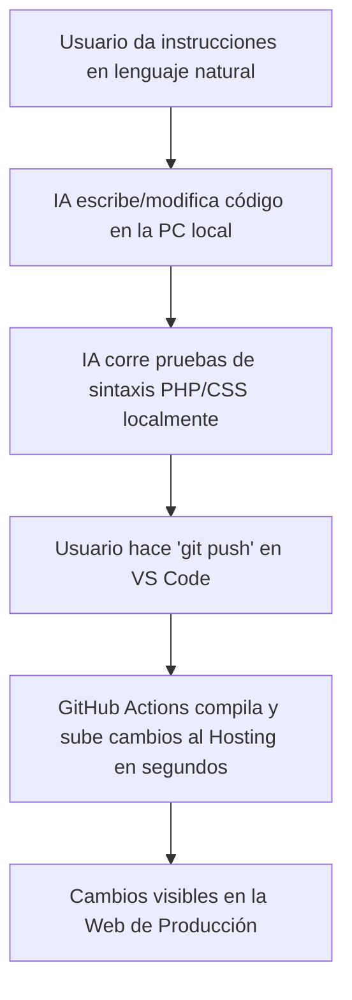

# Documentación del Entorno de Desarrollo y Despliegue - AJE Distribuidora Faucett

Este documento centraliza toda la configuración técnica del entorno de desarrollo para el tema de WordPress **Grogin (v1.3.3)** en la distribuidora. Detalla el funcionamiento de **GitHub Actions**, la integración del servidor **WordPress MCP** para edición con Inteligencia Artificial, y cómo sacar el máximo provecho en tu flujo de **Vibecoding**.

---

## 🚀 1. Despliegue Continuo con GitHub Actions (CI/CD)

Hemos configurado un flujo de integración y despliegue continuo para que no tengas que comprimir y subir archivos `.zip` de forma manual nunca más.

### Cómo funciona:
Cada vez que realizas un cambio en tu código y ejecutas un `git push`, los servidores de GitHub interceptan la subida y se encargan de subir únicamente los archivos modificados a tu hosting a través de FTP/SFTP.

### Archivo de Configuración:
El archivo de automatización se encuentra en la ruta de tu tema:
📄 [`.github/workflows/deploy.yml`](file:///.github/workflows/deploy.yml)

### Credenciales de Seguridad (Secrets de GitHub):
Las contraseñas de tu hosting están protegidas encriptadamente en tu repositorio de GitHub. Para que el despliegue funcione, debes añadir los siguientes secretos en **Settings > Secrets and variables > Actions**:
1.  `FTP_SERVER`: La IP de tu hosting o tu host FTP (ej. `ftp.ajedistribuidorafaucett.com`).
2.  `FTP_USERNAME`: El usuario FTP exclusivo creado en cPanel (ej. `github-deploy@ajedistribuidorafaucett.com`).
3.  `FTP_PASSWORD`: La contraseña de la cuenta FTP exclusiva que configuraste.

*Nota: La ruta de destino está configurada en `wp-content/themes/grogin/` debido a que la cuenta FTP en cPanel está anclada directamente en la raíz pública (`public_html/`).*

---

## 🤖 2. Edición con Inteligencia Artificial (WordPress MCP)

Para permitir que el asistente de IA gestione tu tienda de WooCommerce directamente desde el chat, configuramos el archivo de conexión de Model Context Protocol (MCP) en tu editor.

### Archivo de Configuración Local:
📄 [`C:\Users\cagor\.gemini\config\mcp_config.json`](file:///c:/Users/cagor/.gemini/config/mcp_config.json)

### Código de Conexión del Servidor:
```json
"wordpress": {
  "command": "npx",
  "args": [
    "-y",
    "mcp-wordpress"
  ],
  "env": {
    "WORDPRESS_SITE_URL": "https://ajedistribuidorafaucett.com",
    "WORDPRESS_USERNAME": "AlucardDK",
    "WORDPRESS_PASSWORD": "xeuJ 2t4f F945 MPMr MTCN XDko"
  }
}
```

### Autenticación Segura (Contraseña de Aplicación):
La contraseña `"xeuJ 2t4f F945 MPMr MTCN XDko"` es una clave del sistema generada desde WordPress (**Usuarios > Perfil > Contraseñas de aplicación**). Esto evita usar tu contraseña personal y permite revocar el acceso de la IA en cualquier momento con un solo clic.

---

## ⚡ 3. Posibilidades de Uso y Comandos con IA

Al tener conectados GitHub Actions y la API de WordPress MCP, puedes pedirle a la IA que realice tareas complejas utilizando comandos de lenguaje natural:

### A. Gestión de WooCommerce (Productos, Precios y Stock)
Puedes pedirle a la IA que interactúe directamente con tu catálogo de distribución:
*   *“Crea 5 productos de la marca Big Cola con sus precios y agrégalos a la categoría Bebidas.”*
*   *“Revisa cuáles productos están sin stock y cámbiales el estado.”*
*   *“Aplica un descuento del 15% a todos los productos de la categoría Refrescos.”*

### B. Gestión y Control de Plugins
El servidor MCP tiene acceso para gestionar los complementos del sitio:
*   *“Lista todos los plugins instalados y dime cuáles están inactivos.”*
*   *“Activa el plugin de WooCommerce y desactiva Hello Dolly.”*
*   *“Instala un plugin gratuito para optimizar el tamaño de las imágenes.”*

### C. Personalización y Diseño de Temas (Vibecoding)
Puedes pedir cambios estéticos o de funciones del tema, los cuales se programarán localmente y se subirán solos a tu hosting:
*   *“Cambia el color principal del tema a la paleta de colores de AJE Distribuidora.”*
*   *“Haz que el slider de la página de inicio cargue en carrusel infinito.”*
*   *“Corrige cualquier error de sintaxis CSS o PHP en las hojas de estilo del tema.”*

---

## 🎨 4. Elementor y Elementor Pro: ¿Cómo sacarle el máximo provecho?

### Elementor Free + Grogin Core (Suficiente por defecto):
El tema viene con el plugin **Grogin Core**, el cual añade todos los widgets del supermercado (Sliders, Banners, Product Carousels) directamente a la versión **gratuita** de Elementor. No necesitas pagar la licencia Pro para tener la demo idéntica a la imagen oficial.

### Si decides añadir Elementor Pro:
Tener la versión Pro te permite delegar a la IA las siguientes tareas avanzadas:
1.  **Ganchos (Hooks) en PHP:** Puedo escribir código personalizado en `functions.php` para conectarse a las llamadas de acción (actions) de Elementor Pro (por ejemplo, enviar los datos de un formulario de contacto de Elementor Pro a una API de logística externa o a una hoja de cálculo).
2.  **Estilos CSS a medida:** Elementor Pro permite añadir CSS personalizado por cada widget. Puedes arrastrar un widget Pro y pedirme: *"Escribe el código CSS para este ID de widget para que tenga un efecto de cristal (glassmorphism) al pasar el cursor"*.
3.  **Plantillas Dinámicas:** Puedo programar shortcodes para incrustar plantillas dinámicas de Elementor Pro en zonas del tema que no son editables visualmente por defecto.

---

## 📋 5. Flujo de Trabajo Diario de Vibecoding

Para trabajar a máxima velocidad, este es el flujo diario recomendado:



1.  **Pide la mejora:** Pídele a la IA el cambio estético, lógico o de base de datos que desees.
2.  **Validación de sintaxis:** La IA ejecutará herramientas como el linter de PHP (`php -l`) en tu entorno local (XAMPP) para asegurar que el código no cause pantallas blancas (White Screen of Death) en producción.
3.  **Sube tus cambios:** Ejecuta la subida a Git. En pocos segundos el hosting estará actualizado de forma segura.
